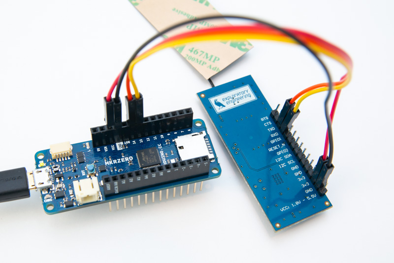
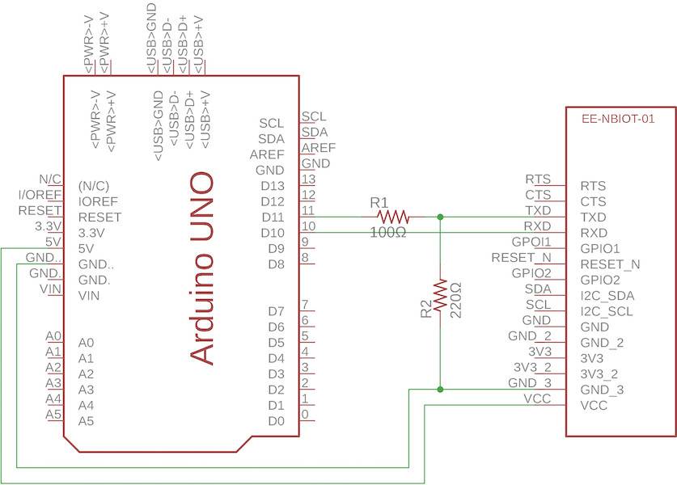
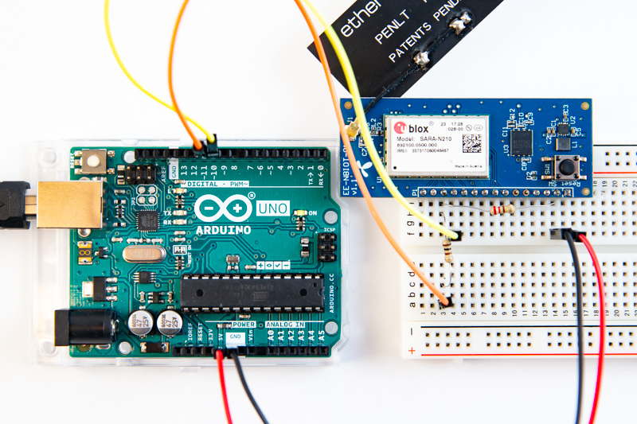

This is a guide to send data over NB-IoT from and Arduino using the Telenor [EE-NBIOT-01][1] module. Which is a developer kit we've made to lower the barrier to get started experimenting with NB-IoT. The [EE-NBIOT-01][1] board is a breakout board to the [u-blox SARA-N210][2] radio module with a Telenor Norway SIM-card, antenna and a voltage regulator. The guide also relies on our self service NB-IoT Developer Platform. See our separate tutorial on how to [setup a device in the NB-IoT Developer Platform](insert link here). As of 1st October 2018 the platform is only enabled for Telenor Norway.

**Prerequisites**
- Compatible Arduino board (see [3.3V Arduino](#3-3v-arduino) below for recommended boards)
- The [EE-NBIOT-01][1] board
- [Arduino IDE already installed](https://www.arduino.cc/en/Main/Software)
- [Know how to use your Arduino board](https://www.arduino.cc/en/Guide/HomePage) (see instructions for each board on the right side)

## Connecting EE-NBIOT-01
The serial pins for the SARA-N210 is using 3.3V logic and it's specified to a max of 4.25V. This means we can't directly connect an Arduino with a 5V operating voltage to the TX pin.

### 3.3V Arduino
These arduino boards have 3.3V operating voltage, and can be directly connected to the EE-NBIOT-01: Arduino Zero, Arduino MKR Zero, Arduino M0 and Arduino Due. These boards also have the benefit of having extra hardware serial ports, so you don't have to use software serial. The hardware serial pins are hooked up to `Serial1` in the boards core source file, and the pins are marked RX1/TX1 or just RX/TX on the board header connections.

In Norway you should be able to find them in any of these stores:
* [Kjell & Company](https://www.kjell.com/no/)
* [Digital Impuls](https://www.digitalimpuls.no/)
* [ELFA Distrelec](https://www.elfadistrelec.no/)

**Pin connections:**

3.3V Arduino   | EE-NBIOT-01
--------------:|------------
3.3V - red     | 3v3
GND - black    | GND
RX1/RX - yellow   | RXD
TX1/TX - orange   | TXD

[ 
See image in full resolution](img/mkrzero.jpg)

### 5V Arduino (Uno)
Arduino Uno and most other Arduino boards have 5V operating voltage. That means the digital pins also are 5V when they're high, so if we connect a digital pin to the TX pin on the EE-NBIOT-01 we risk damaging the radio module. 
Because the I/O on the Arduino Uno is 5V, you need a voltage divider on TX so we don't damage the EE-NBIOT-01. Use a 100Ω resistor for R1 and a 220Ω resistor for R2 should give an output of 3.4V - which is well within the max of 4.25V of the SARA-N210. Because the EE-NBIOT-01 uses 3.3V internally, RX will be 3.3V already, which is enough to trigger high on the Arduino pin. In other words we don't need a voltage divider for RX.

[ 
See image in full resolution](img/arduino-uno.jpg)

## Arduino NB-IoT library
Download and install our [Telenor NB-IoT Arduino library](https://github.com/ExploratoryEngineering/ArduinoNBIoT/blob/master/README.md). After it is installed, you will find two example sketches under:
- File
    - Examples
        - Telenor NB-IoT
            - hello
            - interactive

### hello
Prints out IMSI and IMEI to the serial monitor (Tools -> Serial Monitor). You need these when adding the device to the NB-IoT Developer Platform.

Then it tries to connect to the network and send a text string "Hello, this is Arduino calling" to the NB-IoT Developer Platform.

### interactive
An interactive terminal program. Upload code and open Tools -> Serial Monitor. You should be presented with a menu. Type the letter to the left of the command you want to perform and press send. You'll get the result printed to the serial monitor.

[1]: https://shop.exploratory.engineering/collections/frontpage/products/ee-nbiot-01-v1-1-breakout-module
[2]: https://www.u-blox.com/en/product/sara-n2-series#tab-documentation-resources
