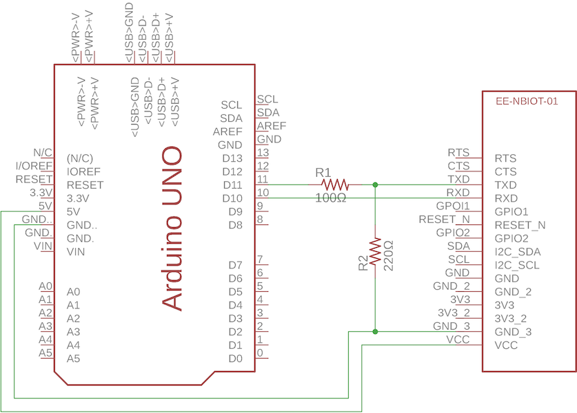
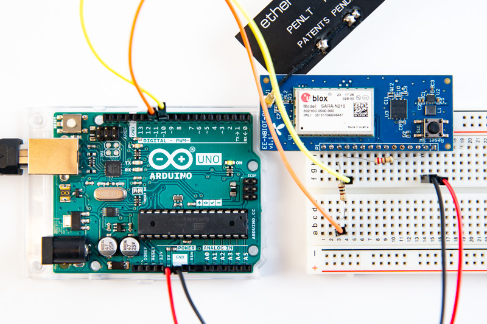

If you don't have a USB to serial adapter but would still like to get started playing with the [EE-NBIOT-01][1], it's also possible to use a microcontroller like Arduino to forward serial data between the computer and the [EE-NBIOT-01][1]. The easiest is to use an Arduino board with 3.3V operating voltage, which also has 3.3V on the I/O pins. Most Arduino boards, like the popular Arduino Uno, have 5V I/O logic. For those you'll need a voltage divider on TX so we don't damage the EE-NBIOT-01.

### Arduino with 3.3V operating voltage
The boards with 3.3V logic don't need a voltage divider and are straightforward to use: Arduino Zero, Arduino MKR Zero, Arduino M0, Arduino Due. See the photo below for how to connect these boards.

<a href="img/mkrzero.jpg" target="_blank"><br/>
See image in full resolution</a>

### Arduino with 5V operating voltage
Using a 100Ω resistor for R1 and a 220Ω resistor for R2 should give an output of 3.4V - which is well below the max of 4.25V of the SARA-N210. Because the EE-NBIOT-01 uses 3.3V internally, RX will be 3.3V already, which is enough to trigger high on the Arduino pin. In other words we don't need a voltage divider for RX.


<a href="img/arduino-uno.jpg" target="_blank">[<br/>
See image in full resolution</a>

### Arduino NB-IoT Serial Forwarder
You'll also need to upload this sketch to the Arduino board

```c_cpp
#ifdef SERIAL_PORT_HARDWARE_OPEN
// For Arduino boards with a hardware serial port separate from USB serial. This is usually mapped to Serial1.
// Check which pins are used for Serial1 on the board you're using.
#define serial SERIAL_PORT_HARDWARE_OPEN
#else
// For Arduino boards with only one hardware serial port, like Arduino Uno. It is mapped to USB, so we use
// SoftwareSerial on pin 10 and 11 instead.
#include <SoftwareSerial.h>
SoftwareSerial serial(10, 11);
#endif

void setup() {
  Serial.begin(9600);
  nbiot.begin(9600);
}

void loop() {
  if (Serial.available()) {      // When data on USB serial
    nbiot.write(Serial.read());  // Forward it to pin 11
  }

  if (nbiot.available()) {       // When data on pin 10
    Serial.write(nbiot.read());  // Forward it to USB serial
  }
}
```

[1]: https://shop.exploratory.engineering/collections/frontpage/products/ee-nbiot-01-v1-1-breakout-module
