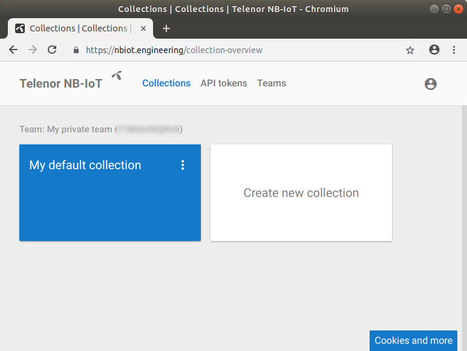
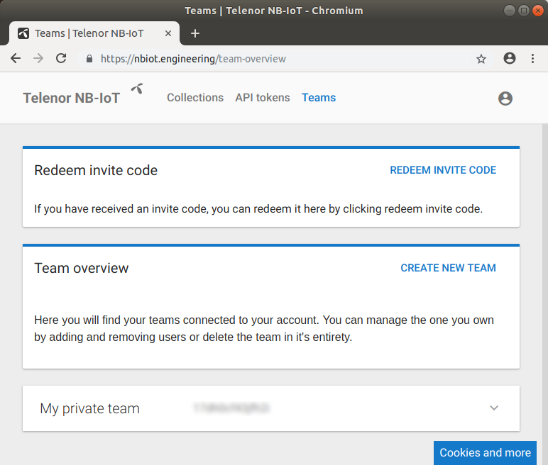
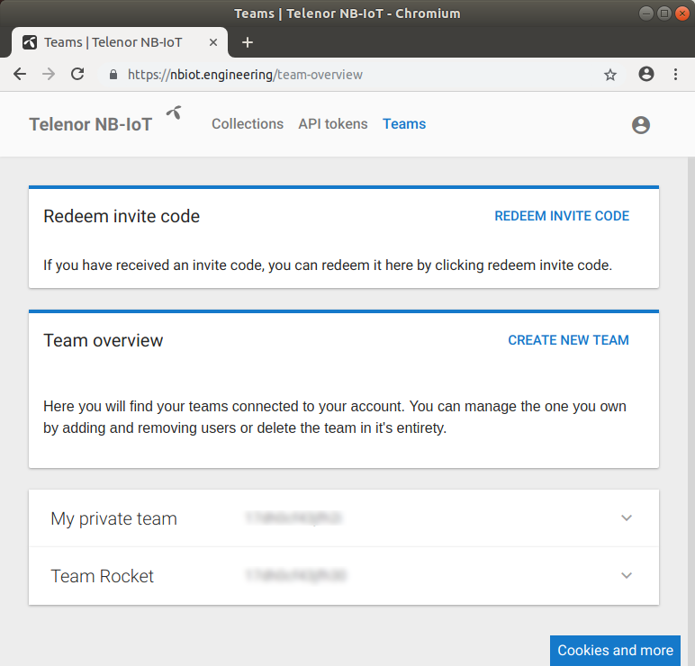
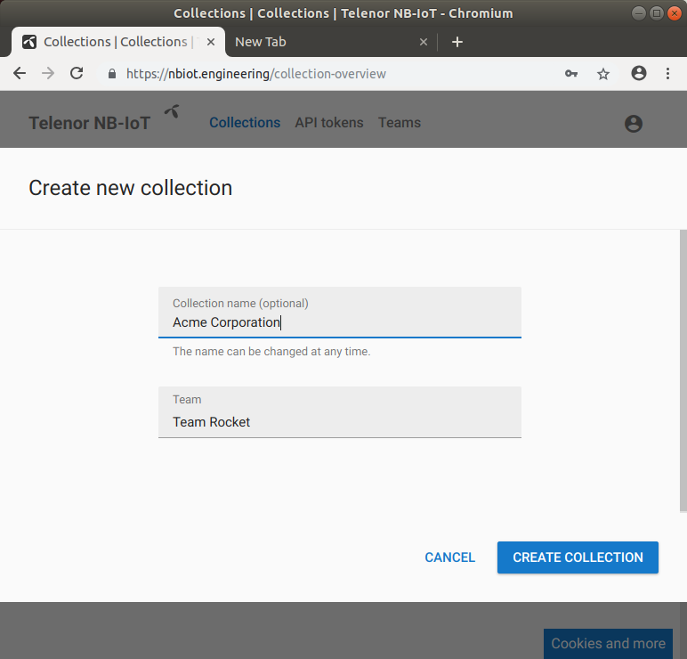
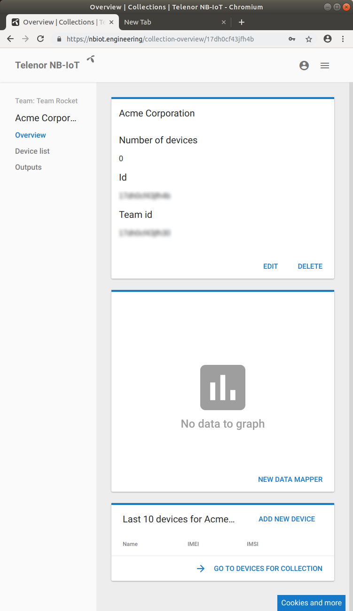
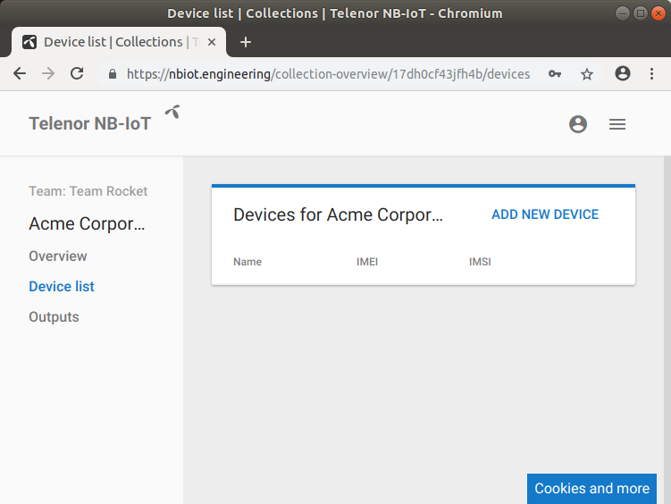
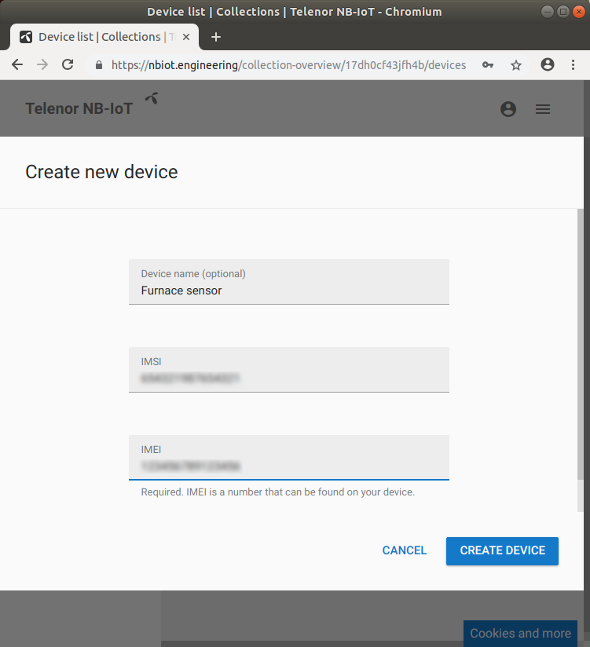
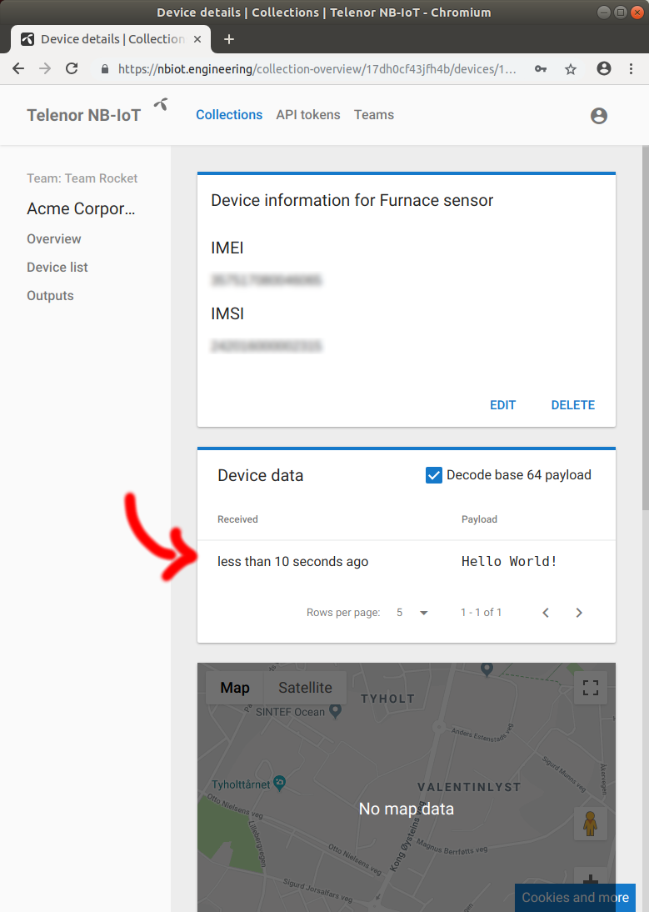

So you've got your EE-NBIOT-01 and are anxious to get started. Before the fun can start we need to complete some steps in the Telenor NB-IoT Developer Platform. Let's go!

### Login
Navigate to https://nbiot.engineering. In order to login, you will need a CONNECT account. If you don't have a CONNECT account, you can just enter your phone number and follow the instructions. Once logged in you should be greeted by a simple dashboard:

### Key concepts
Before we go any further, let's get familiar with some key concepts in the Telenor NB-IoT Developer Platform: NB-IoT devices are called (drum roll, please) _devices_. Devices are grouped into _collections_. A collection may contain zero or more devices. Collections (and, by extension, devices) are owned by _teams_. A team consists of one or more _users_. As a user you are always part of a team, including your own private one-person team. 

### Create a Team
You already have a _user_, the one you logged in with, so let's create a team. Navigate over to *Teams*:

Click on the `Create new team` button, give it a name, and create the team:

Once the new team is created, the team overview is updated to show the new team:

### Create a Collection
Back at the collection overview we are presented with the possibility to create a new collection for our new team.

Click the `Create new collection`, fill in the form, and create the collection:

### Add a device
With our new collection created, it's time to add a device. Clicking on the collection takes us to an overview:

Navigate to _Device list_:

Click on _Add device_ and fill in the form:

The device name is optional, but it is crucial to get both the IMSI and IMEI correct. In order to get the device IMSI you must query the device itself. The command to query the device for its IMSI is `AT+CIMI`, but you must first enable the radio by issuing `AT+CFUN=1` and waiting a few seconds.

You can also query the device for its IMEI by issuing `AT+CGSN=1`, which is much more convenient than reading it off the tiny label.

Check out the [Interactive terminal tutorial](interactive-terminal.html) to learn how to issue commands to the EE-NBIOT-01.

### View data from device
With the device created, it's time to check that everything is working properly. Looking at the _Device list_ in our collection, we find our newly created device:

After clicking on the device's name, we are presented with information about the device. Check the _"Decode base 64 payload"_, send some data and watch it appear! Check out the [Interactive terminal tutorial](interactive-terminal.html) to learn how to send data.

The data has arrived and setup is now complete! 
