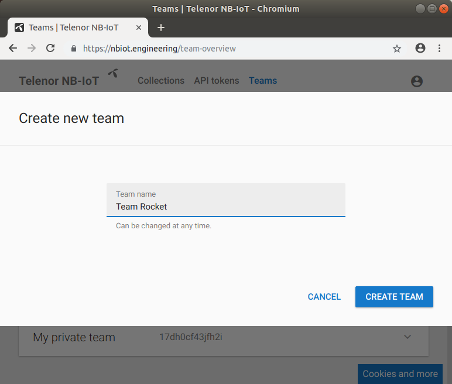
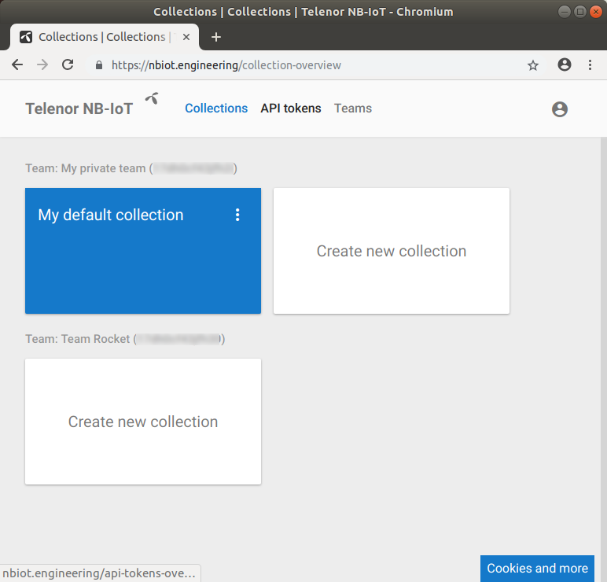
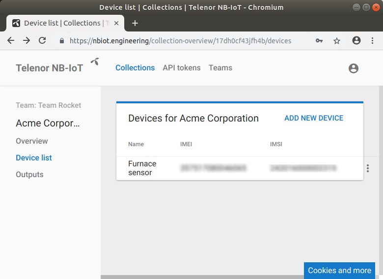

So you've got your EE-NBIOT-01 and you anxious to get started. Before the fun can start we need to complete some steps in the Telenor NB-IoT Developer Platform. Let's go!

### Login
Navigate to `https://nbiot.engineering`. In order to login, you will need a CONNECT account. If you don't have a CONNECT account, you can just enter your phone number and follow the instructions. Once logged in you should be greeted by a simple dashboard:

### Key concepts
Before we go any further, you should be familiar with some key concepts in the Telenor NB-IoT Developer Platform: NB-IoT devices are called _devices_. Devices can be grouped into _collections_. A collection may contain zero or more devices. Collections and devices are owned by _teams_. A team consists of one or more _users_. As a user you are always part of a team, including your own private one-person team. 

### Create a Team
You already have a _user_, the one you logged in with, so let's create a team. Navigate over to *Teams*:

Create a new team:

Once the new team is created, the team overview is updated and changes reflected:

### Create a Collection
Back at the collection overview we are presented with the possibility to create a new collection for our new team.

Create a new collection:

### Add the device
With our new collection created, it's time to add a device. Clicking on the collection takes us to an overview:

Navigate to _Device list_:

Click on _Add device_ and fill in the data. The device name is optional, but it is crucial to get both IMSI and IMEI correct. The command used to query the device for its IMSI is `AT+CIMI` and `AT+CGSN=1` for IMEI. Note! If you get an `ERROR` message when you issue the `AT+CIMI` for the IMSI, try to enable the radio first by issuing `AT+CFUN=1`, wait a couple of seconds and try again. Check out the [Interactive terminal tutorial to EE-NBIOT-01](interactive-terminal.html) to learn how to issue commands to the EE-NBIOT-01.

### View data from device
With the device created, it's time to check that everything is working properly. Looking at the _Device list_ in our collection, we find our newly created device:

By clicking on the device's name, we are presented with information about the device. Check the _"Decode base 64 payload"_, send some data and watch it appear! Check out the [Interactive terminal tutorial to EE-NBIOT-01](interactive-terminal.html) to learn how to send data.

The data has arrived and setup is now complete! 
