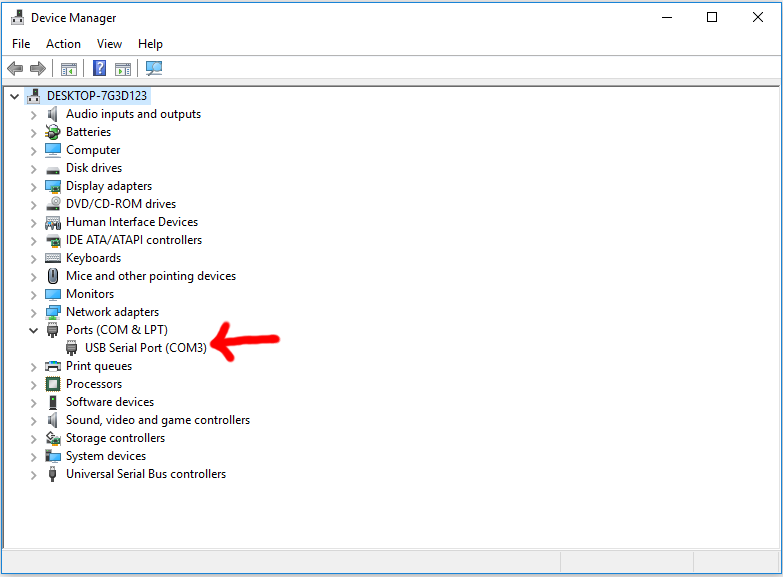
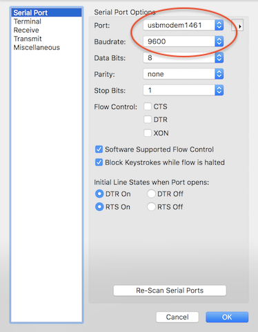
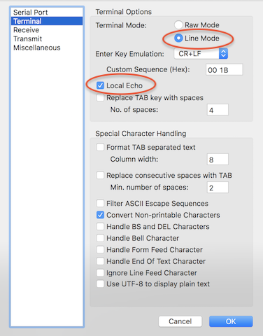
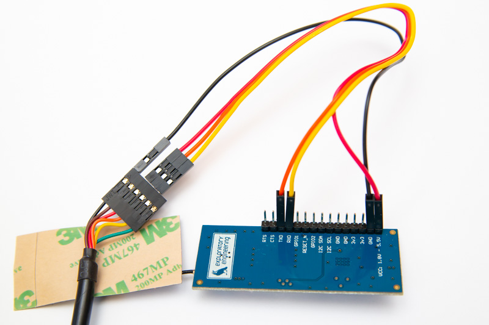
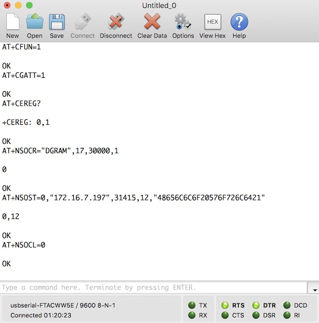

The [EE-NBIOT-01][1] board is just a breakout board to the [u-blox SARA-N210][2] radio module with a Telenor Norway SIM-card, antenna and a voltage regulator.

This guide is a simple walk-through of how to get started with communication with the module directly from your computer without the use of a microcontroller. The same commands can of course be called from a microcontroller instead, so with this knowledge you can implement a library for the EE-NBIOT-01 for any microcontroller in any language you prefer.

## Contents

- [Parts needed](#parts-needed)
- [Connecting to the EE-NBIOT-01](#connecting-to-the-ee-nbiot-01)
    - [USB to serial adapter](#usb-to-serial-adapter)
    - [Install serial adapter driver](#install-serial-adapter-driver)
    - [Serial terminal application](#serial-terminal-application)
    - [Connecting the cables](#connecting-the-cables)
- [Terminal commands](#terminal-commands)
    - [Preparations](#preparations)
    - [Hello world](#hello-world-)
    - [Important AT commands cheat sheet](#important-at-commands-cheat-sheet)
    - [APN config](#apn-config)

## Parts needed
* A computer with Windows/macOS/linux
* [EE-NBIOT-01][1]
* A USB to serial adapter with 3.3V logic (see next section)
* Jumper cables between the serial adapter and the [EE-NBIOT-01][1] board

## Connecting to the EE-NBIOT-01
Here is a brief guide on what you need and how to set up the serial communication with the EE-NBIOT-01. If you need more details, [SparkFun has an excellent in depth guide on Serial Terminal Basics](https://learn.sparkfun.com/tutorials/terminal-basics/serial-terminal-overview).

### USB to serial adapter
The communication to the u-blox SARA-N210 is just a simple serial connection with text commands. Modern computers don't have a serial port any more, so you need a special USB cable to connect the serial pins (RX/TX) of the EE-NBIOT-01 board to your computer. These cables are often called FTDI, UART, or TTL cables.

The SARA-N210 RX/TX pins require 3.3V. The absolute max in the SARA-N210 datasheet is 4.25V; more may lead to damaging the SARA-N210 module. So make sure you get a cable that has 3.3V logic for RX/TX.

Regarding power, the EE-NBIOT-01 has a buck voltage regulator that can handle 1.8V-5.5V input, so it's fine if the USB to serial adapter has 5V VCC.

Here are a few suggestions for adapters:
* [Adafruit USB to TTL Serial Cable](https://www.adafruit.com/product/954)
* [Adafruit FTDI Serial TTL-232 USB Cable](https://www.adafruit.com/product/70)
* [Adafruit FTDI Friend](https://www.adafruit.com/product/284)
* [Sparkfun FTDI Cable 5V VCC-3.3V I/O](https://www.sparkfun.com/products/9717)
* [Use an Arduino board as a serial adapter](arduino-serial-forwarder.html)

In Norway you should be able to find them in any of these stores:
* [Kjell & Company](https://www.kjell.com/no/sok?query=ftdi)
* [Digital Impuls](https://www.digitalimpuls.no/search?q=ftdi)
* [ELFA Distrelec](https://www.elfadistrelec.no/)

### Install serial adapter driver
Most cables require you to install a driver for the USB serial adapter. Check the product description and it should guide you to the correct driver for your operating system.

### Serial terminal application
You can use any serial terminal application you like. We'll only explain how to use CoolTerm in this guide - since it's free, easy to use and works on Windows, macOS and Linux.

1. [Download and install CoolTerm for your OS](http://freeware.the-meiers.org/)
1. Open app and click the «Options» button
1. Choose which serial port to use
    - This depends on which driver and operating system you use. 
        - In Linux the serial ports are treated as files, typical examples would be `/dev/ttyS0`, `/dev/ttyUSB0` if you use a USB to serial adapter or `/dev/ttyAMA0` on the Raspberry Pi.
        - In Mac OSX serial ports can have various names, for example `usbserial-FTACX955`.
        - At last there is Windows. In Windows, the serial port is an abstraction called a "COM port". You can find these by looking the device manager. In the screenshot below, we have connected a TTL-232 USB cable to the machine:
        
1. Set the baud rate to 9600

  
1. Go to «Terminal» options (on the left)
1. Change to «Line Mode»
1. Check «Local Echo» to see the commands you've sent
1. Leave the rest of the options as default and click «OK»

  
1. Click the «Connect»-button
1. Enter commands in the input field near the bottom of the window

### Connecting the cables
Normally on a serial connection, the TX is the output from one device and RX is the input. So when you connect two devices, you would connect TX->RX both ways. However, u-blox thought otherwise, so they've labled the input as TX and output as RX. To avoid an extra layer of confusion we used the same labeling as u-blox on the EE-NBIOT-01. So when connecting the wires - **connect RX to RX and TX to TX**.

**NB! Make sure the cable has 5V to 3.3V logic level conversion on RX&TX**

**Table 1:**

Serial adapter | EE-NBIOT-01
--------------:|------------
VCC +5V/3.3V - red | VCC
GND - black | GND
RX - yellow | RXD
TX (**3.3V**) - orange | TXD

<a href="img/ftdi.jpg" target="_blank"> 
See image in full resolution</a>

## Terminal commands
You control the u-blox SARA-N210 by sending it AT-commands over the serial connection. The response will be prefixed with `> ` to indicate it's a response and not something you should write in the terminal.

### Preparations
All EE-NBIOT-01 modules have the APN set manually before we send them out, but in case you have another module or need to set it manually, see [APN config](#apn-config).

If you haven't registered the devie in the [Telenor NB-IoT Developer Platform](https://nbiot.engineering) yet, now is a good time. You'll need the IMSI and IMEI:

    AT+CIMI;+CGSN=1;
    > <IMSI number>
    > OK
    > +CGSN: <IMEI number>
    > OK

Save these numbers and follow the [getting started guide](getting-started.html) to add the device, so you'll be able to watch the incoming data that you're about to send in the next section.

### Hello world!
Check if we are registered on the network yet?:

    AT+CEREG?
    > +CEREG: 0,2

The seccond response value (`2`) is the registration status. Status `2` is not registered, but it's currently trying to attach or searching for an operator to register to.

Wait a few seconds and try again:

    AT+CEREG?
    > +CEREG: 0,1

Now the registration status is `1`, which means it's registered to the home network.

Then open a new UDP socket. If successful, the first line of the response will be the socket number. You need the socket number later when sending data.

    AT+NSOCR="DGRAM",17,30000,1
    > 0
    > OK

Now socket 0 is ready to send UDP data to a server. The APN we configured earlier will forward data from devices in the Telenor network to your application server.

    AT+NSOST=0,"172.16.15.14",1234,12,"48656C6C6F20576F726C6421"
    > 0,12
    > OK

The first response line is `<socket>`,`<sent_length>`, followed by OK if it was successful.

To close socket 0:

    AT+NSOCL=0

### Important AT commands cheat sheet
This is just a summary of the commands we find the most useful. For the complete list, download the u-blox «SARA-N2 AT Commands» PDF from the [u-blox website][2] instead.

Most commands have 3 syntaxes. Read (`COMMAND?`), set (`COMMAND=...`) and test (`COMMAND=?`). Test will list possible values for all arguments.

**Table 2:**

| Command name                | Syntax | Response | Description |
|-----------------------------|--------|----------|-------------|
| Enable/disable radio        | `AT+CFUN=<fun>` | OK | `<fun>` values: **0**: Disable the radio **1**: Enable the radio |
| Read IMEI                   | `AT+CGSN=1` ¹ | `<imei>` OK | Request the IMEI (International Mobile Equipment Identity). |
| Read IMSI                   | `AT+CIMI`   | `<imsi>` OK | Request the IMSI (International Mobile Subscriber Identity). |
| Operator selection          | `AT+COPS=<mode>` ¹ | OK | Force an attempt to select and register with the network operator. Through `<mode>` parameter the network selection can automatically be performed or forced by this command. Supported `<mode>` values: **0**: (default) automatic **1**: manual **2**: deregister from network |
| GPRS attach/detach          | `AT+CGATT=[<state>]` | OK | Attach or detach to/from the mobile network. Allowed `<state>` values: **0**: Detach from network **1**: Attach to network |
| Check if GPRS attached      | `AT+CGATT?` | `+CGATT: <state>` OK | Check if SARA-N210 is attached to the mobile network or not. `<state>` values: **0**: Detached from network **1**: Attached to network |
| Network registration status | `AT+CEREG?` | `+CEREG: <n>,<stat>` ¹ OK | This command has 6 different modes, each of which gives different return values. Response is `+CEREG: <n>,<stat>[...]`, where `<n>` is the mode number and `<stat>` is the registration status. See chapter 9.6.3 in «SARA-N2 AT Commands» for all modes and descriptions. Here are the `<stat>` number values: **0**: not registered, the MT is not currently searching an operator to register to **1**: registered, home network **2**: not registered,but the MT is currently trying to attach or searching an operator to register to **3**: registration denied **4**: unknown (e.g. out of E-UTRAN coverage) **5**: registered, roaming **8**: attached for emergency bearer services only |
| Check signal strength       | `AT+CSQ` | `+CSQ: <signal_power>,<qual>` OK | Request _signal_power_ and _qual_. On the SARA-N210, _qual_ will always be 99. The mapping between _signal_power_ and RSSI dBm is `-113 + (signal_power * 2)`. Example response:  `+CSQ: 25,99` RSSI = (`-113 + (25 * 2)`) = -63 dBm |
| Create socket | `AT+NSOCR=<type>,<protocol>,<listen_port>,<receive_control>` | `<socket>` OK | Create a socket. If a port is set, receiving is enabled and +NSONMI URC will appear for any message that is received on that port. Max number of ports: 7. Supported `<type>`: `"DGRAM"` Supported `<protocol>`: `17` (UDP) Port range: 0-65535 except for 5683. `<receive_control>` allowed values: **0**: incoming messages will be ignored **1**: (default) incoming messages will trigger a +NSONMI URC  **Response**: Socket identifier to be referenced by the other socket AT commands|
| Send UDP to IP              | `AT+NSOST=<socket>,<remote_ip_address>,<remote_port>,<length>,<data>` | `<socket>,<sent_length>` OK | Send a UDP datagram to the specified host and port. See Table 3 for parameter descriptions. |
| Send UDP to IP with flags   | `AT+NSOSTF=<socket>,<remote_ip_address>,<remote_port>,<flags>,<length>,<data>` | `<socket>,<sent_length>` OK | Send a UDP datagram to the specified host and port with flags. Needed for power saving mode. See Table 3 for parameter descriptions.       |
| Error report formatting     | `AT+CMEE=[<n>]` | OK | Configure formatting of errors. List of supported _\<n\>_ values: **0**: ERROR **1**: +CME ERROR: _\<err\>_  See Appendix A in the «SARA-N2 AT Commands» documentation for error result code descriptions. |
| Config                      | `AT+NCONFIG=<function>,<value>` | OK | Configure customizable aspects of the SARA-N210 (e.g Auto Attach). The changes are effective after the module reboot by means of the `AT+NRB` command. Use `AT+NCONFIG?` to show current config. |
| PDP context definition      | `AT+CGDCONT=[<cid>[,<PDP_ type>[,<APN>[,<PDP_addr>]]]]` ¹ | OK | Define the connection parameters for a PDP context. Usually to configure APN settings manually. See example further up. |
| Device statistics           | `AT+NUESTATS[=<type>]` | `NUESTATS: <type>,<param_ name>,<value>` [NUESTATS: ...] OK | Request the most recent operational statistics of the module. Should be called right after sending. Some interesting values: TX power, ECL (equipment coverage class), throughput, bytes received, bytes sent, cell info. See chapter 4.8 in «SARA-N2 AT Commands» for full description of all fields and available `<type>`s. |
| Reboot                      | `AT+NRB` | REBOOT_CAUSE_APPLICATION_AT u-blox OK | Reboot the SARA-N210. There is a short delay after the command issuing before the SARA-N210 reboots. |
| Power saving mode settings  | `AT+CPSMS=[<mode>[,,,<Requested_Periodic_TAU>[,<Requested_Active_Time>]]]` ¹ | OK | Enable and configure the power saving mode. See own [low power tutorial](low-power.html) for full details and examples. |
| Enable/disable eDRX         | `AT+CEDRXS=<mode>[,<AcT_type>[,<Requested_eDRX_value>]]` | OK | Configure extended discontinuous reception (eDRX) parameters. See own [low power tutorial](low-power.html) for full details and examples. |
| Get network time/clock | AT+CCLK? | `+CCLK: "YY/MM/DD,HH:MM:SS+ZZ"` OK| Fetches the network time/clock. |

¹ - Simplified syntax. See «SARA-N2 AT Commands» for full syntax.

**Table 3:  AT+NSOST parameters (from SARA-N2 AT Commands documentation)**

| Parameter         | Type   | Description                                    |
|-------------------|--------|------------------------------------------------|
| socket            | Number | Socket identifier returned by `AT+NSOCR`       |
| remote IP address | String | Remote host IP address of the remote host in IPv4 format. IP addresses can be specified in decimal, octal or hexadecimal notation. |
| remote port       | Number | A number in the range 0-65535. Remote port the messages will be received on. |
| length            | Number | Size of the data to send. The maximum length 512 bytes. |
| data              | String | Data to be sent (as a hexadecimal string)          |
| flags (for NSOSTF) | Number | Specifies the type of message transmission in hexadecimal format. Values of this argument are formed by logically OR'ing zero or more of the following flags: • 0x000: no flags are set • 0x100: exception message. Send message with high priority • 0x200: release indicator. Indicate release after next message • 0x400: release indicator. Indicate release after next message has been replied to |

### APN config
We need to set the [APN](https://en.wikipedia.org/wiki/Access_Point_Name) so that our devices' upstream messages are forwarded correctly and so that our devices are assigned IP addresses to which can send downstream messages.

Before changing the config we must disable auto-connect because we don't want the device to start connecting while we're modifying the config. Then we need to reboot before the changes will take effect.

    AT+NCONFIG="AUTOCONNECT","FALSE";+NRB
    > OK
    ...
    > REBOOT_CAUSE_APPLICATION_AT
    > u-blox 
    > OK

Now we're ready to update the config. It's not persisted on the SARA-N210, so remember to run this after every reboot:

    AT+CFUN=1;+COPS=1,2,"24201";+CGDCONT=1,"IP","mda.ee";+CGACT=1,1
    > OK
    > OK
    > OK
    > OK

[1]: https://shop.exploratory.engineering/collections/frontpage/products/ee-nbiot-01-v1-1-breakout-module
[2]: https://www.u-blox.com/en/product/sara-n2-series#tab-documentation-resources
