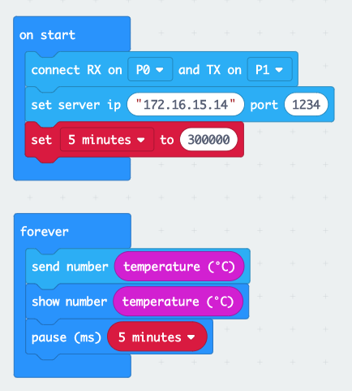

This tutorial will show you how to send data over NB-IoT from a micro:bit using the Telenor [EE-NBIOT-01][1] module.  The [EE-NBIOT-01][1] is a developer kit we've made to lower the barrier for experimenting with NB-IoT.  It is a breakout board to the [u-blox SARA-N210][2] radio module with a Telenor Norway SIM-card, an antenna, and a voltage regulator. The guide also relies on our self service NB-IoT Developer Platform. See our separate tutorial on how to [setup a device in the NB-IoT Developer Platform](getting-started.html). As of 1st October 2018 the platform is only enabled for Telenor Norway.

## Prerequisites
- A [micro:bit](https://microbit.org/resellers/)
- The [EE-NBIOT-01][1] board
- 4 jumper cables
    - Female to male/female (depends on method below)
- A method to connect to the micro:bit
    - Get an [Edge connector breakout board](https://www.kitronik.co.uk/5601b-edge-connector-breakout-board-for-bbc-microbit-pre-built.html)
    - Or improvise [how to connect wires](https://lorrainbow.wordpress.com/2017/11/11/how-to-connect-wires-to-the-microbit/)

## Wiring
The micro:bit has 3.3V power on the I/O (input/output) pins, which is a perfect match for the EE-NBIOT-01. However, if you power the micro:bit from a battery, be aware that the battery needs to have at least 3.1V - which means that two fully charged AA batteries is not enough.

Connect the jumper wires between the following pins:

micro:bit   | EE-NBIOT-01
-----------:|------------
3V - red    | 3v3
GND - black | GND
P0 - yellow | RXD
P1 - orange | TXD

### Edge connector with pin headers
The recommended method to connect a micro:bit to EE-NBIOT-01
<a href="img/microbit-edge-connector.jpg" target="_blank"> 
See image in full resolution</a>

### Improvise wire connection
If you don't have an edge connector nearby and don't have time to wait for one, check out [this guide](https://lorrainbow.wordpress.com/2017/11/11/how-to-connect-wires-to-the-microbit/). Or improvise using what you have available.

## Register device
Before we start prototyping, we need the IMEI and IMSI and register the device in our NB-IoT Developer Platform:

1. Open [this makecode project](https://makecode.microbit.org/_gfV43eEt51Er) and click the «Edit»-button
1. Use a micro-USB cable to connect the micro:bit to your computer
1. The micro:bit should show up as a regular USB memory stick on your computer, called MICROBIT
1. Click the  button to download the sketch and save it to the MICROBIT drive
1. The sketch will now magically be flashed to the micro:bit
1. After a few seconds you should see «PRESS A/B» scroll by on the LEDs on the micro:bit
1. Get a pen and paper, press the A/B buttons and write down the numbers
1. Follow our [Getting started with the Telenor NB-IoT Developer Platform guide](getting-started.html) and use the IMEI/IMSI from the step above
1. Leave the browser tab with live device data open, so we can see data we send in the next section

## Install nbiot extension
1. Go to [makecode.microbit.org](https://makecode.microbit.org/)
1. Click on the big *«New Project»-button*
1. Click the *gear* in the top right, then *Extensions*
    - 
1. In the search field, enter the URL below and click the search button
    1. https://github.com/ExploratoryEngineering/pxt-nbiot
    1. Select «nbiot» in the search result
    - 
1. You should now get an «NB-IoT» category in the blocks menu
    - 

## Hello World
Drag-n-drop blocks from the menu to reproduce the blocks below:

### What's going on here?
In the block editor, every chain of blocks starts with an event (something happened). All the blocks inside of it will be executed in order from top to bottom.

“on start” is only run once, when the micro:bit starts. So here you typically add blocks that should be run before any other code, and only needs to run once. For the NB-IoT extension to work, we need to tell it what pins on the micro:bit it is connected to, and what server IP and port to send data to.

“on nbiot connected” is run once, when the device is successfully connected to the NB-IoT nettwork, and get an IP address from our NB-IoT Development Platform. If the device is not registered (see steps above), you'll not get an IP address and will not be able to connect. First show a heart in the LED display to indicate that we connected, then send the text string «Hello World!». If you still have the browser tab from the NB-IoT Developer Platform open (see [Register Device](#register-device)), you should see that some data has arrived. If it shows up as «SGVsbG8gV29ybGQh», you need to tick the «Decode base 64 payload» checkbox to show it as text.

## Sending useful data
Sending a hard-coded text isn't that useful other than to check that everything works as it should. The fun really begins when we start connecting the physical world with the digital. So try to send some sensor data (like temperature), or send a message when something happens (like a button press or that the micro:bit moves). The micro:bit has a few sensors built in, but if you feel adventurous you can also add other sensors by connecting to one of the pins (definitely get an edge connector breakout board for that). Remember that NB-IoT is meant for small data amounts, so try to keep the size of the data small and don't send too frequently.

Here are some examples of what you can do:

### Temperature logger
Log data at a regular interval. Make sure you don't send too much data too often, or you might run out of data quota.

### Sending a message when _something happens_
To reduce power and data consumption, you can choose to only send data when _something happens_. You read a sensor value and send an alert when the value is not within the expected range. What sensor to use depends of the use-case, but you can connect almost any sensor that runs on 3.3V to the micro:bit, and many of the most popular ones have a micro:bit extension already.

Say you have a fridge or freezer with food worth a lot of money in a building you don't visit that often. If the fridge/freezer suddenly stops working you'd like to know as soon as possible. Here is one way that could be solved.

## API reference
See the GitHub repository for full [API documentation](https://github.com/ExploratoryEngineering/pxt-nbiot#api-reference) for the micro:bit extension

[1]: https://shop.exploratory.engineering/collections/frontpage/products/ee-nbiot-01-v1-1-breakout-module
[2]: https://www.u-blox.com/en/product/sara-n2-series#tab-documentation-resources
