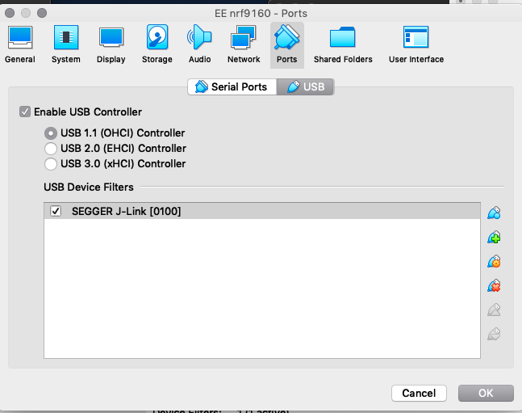
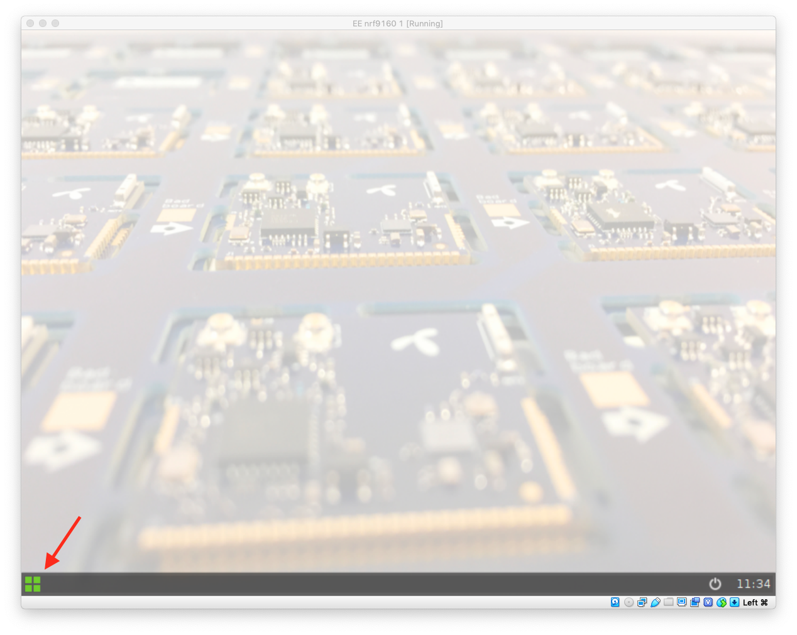
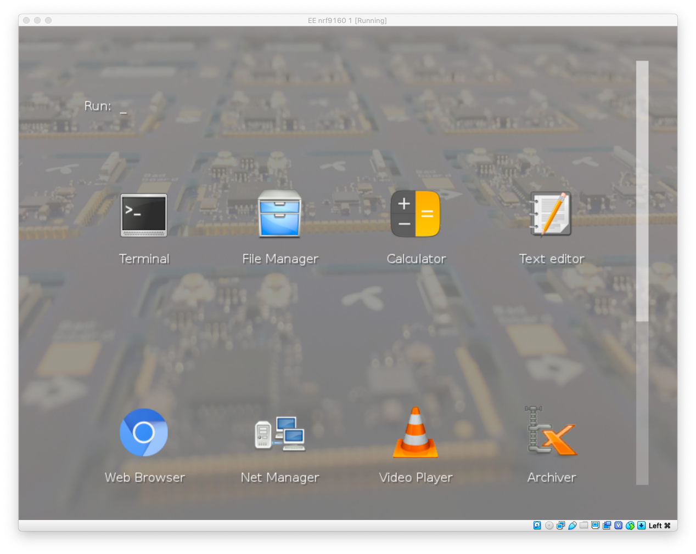
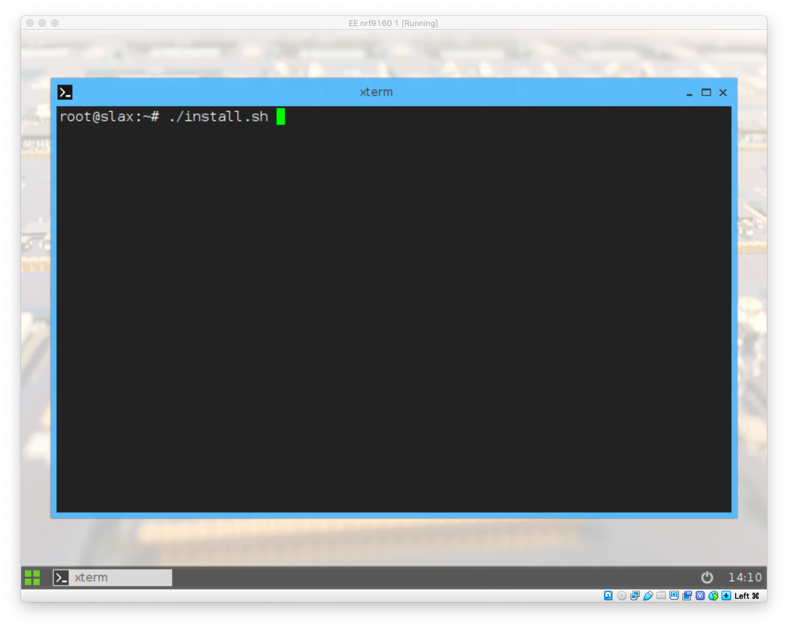

This tutorial will show you how to set up and use VirtualBox as a development environment for the [nRF9160 DK][1] module from Nordic Semiconductor.  It should also be suitable to use any other virtual machine software that uses [.ova](https://en.wikipedia.org/wiki/Open_Virtualization_Format) files.

## Install

First, install [VirtualBox](https://www.virtualbox.org/).  Then, download the [nRF9160 appliance](http://resources.exploratory.engineering/eeNRF9160.ova) that we have assembled, and import it into VirtualBox.

## Setup

Connect the nRF9160 DK to your computer and, in VirtualBox, for the appliance you just imported, go to Settings -> Ports -> USB.  Make sure you see SEGGER J-Link under USB Device Filters:



## Run

Now, turn off or disconnect your nRF9160 DK and start your appliance.  Wait for the appliance to boot, and click on the “start button” in the lower left corner:



Open the terminal by clicking on the Terminal icon:



Connect the nRD9160 DK to your computer and turn it on.  After a couple of seconds, a window will open, which you can close.

In the terminal, run the command:

```sh
./install.sh
```



This script will take quite a bit of time to run.

When it eventually completes, it will have opened another window with the PuTTY application showing the serial output from the firmware running on the nRF9160 DK.  Now is the time to copy the IMEI and IMSI and register the device [as described here](../getting-started.html).


Once you have successfully registered device, hit the RESET button on the nRF9160 DK or in the terminal run:

```sh
nrfjprog -r
```

Give it a minute and you should see the Hello World message in Horde!


[1]: https://shop.exploratory.engineering/collections/nb-iot/products/nrf9160-dev-kit
