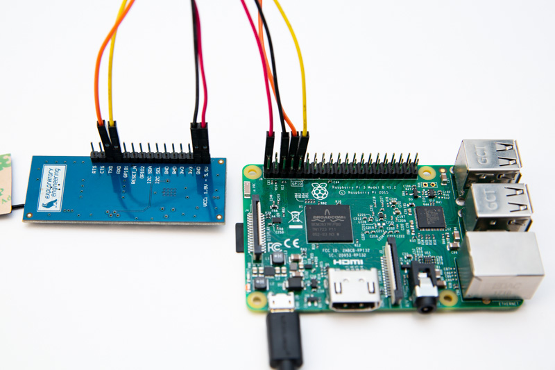

## Preface
This tutorial will focus on how to set up, configure, and use serial ports (UART) to communicate with the [EE-NBIOT-01](https://shop.exploratory.engineering/collections/frontpage/products/ee-nbiot-01-v1-1-breakout-module). It will not cover how to connect to or configure the IP stack of your Raspberry Pi. 

## Serial Communication
All versions of the Raspberry Pi have two serial ports, one is simple and flaky and the other is steady and implemented in hardware. We are interested in the hardware serial port for our application but on the Raspberry Pi 3 and the Raspberry Zero, alas, this serial port is used for the on-board Bluetooth module. **So, if you plan to use the Raspberry Pi 3 or the Zero, you will have to configure you Raspberry Pi to free the serial port from the Bluetooth module's shackles.** Fortunately this is quite simple. The first step is to enable the _GPIO serial port_. This can be done by editing `/boot/config.txt` and adding the following to the end of the file: 

	enable_uart=1

By default the serial port is used as a `console` by the operating system, but that's not what we want, so let's change that:

**Do this if you have a Raspberry Pi 3 and Zero:**
	
	sudo systemctl stop serial-getty@ttyS0.service
	sudo systemctl disable serial-getty@ttyS0.service

**Do this for other devices:**
	
	sudo systemctl stop serial-getty@ttyAMA0.service
	sudo systemctl disable serial-getty@ttyAMA0.service

We also need to take a look in `/boot/cmdline.txt`. The file will probably look something like this:

	dwc_otg.lpm_enable=0 console=serial0,115200 console=tty1 root=PARTUUID=2132391a-02 rootfstype=ext4 elevator=deadline fsck.repair=yes rootwait quiet splash plymouth.ignore-serial-consoles

Delete the `console=serial0,115200` part and leave the rest as it is.

### Raspberry Pi 3 / Zero W specific step
**This step is for the Raspberry Pi 3 and Zero W only.**

So now we've disabled the console, let's swap the serial ports around so we can use them for our purposes. **Keep in mind that the Bluetooth performance will probably suffer by completing this step.** Use caution if Bluetooth is important to you or your application. Enough with the warnings. Open up `/boot/config.txt` and add:

 	dtoverlay=pi3-miniuart-bt

Reboot to apply!

## How to connect
[ 
See image in full resolution](img/raspi-nbiot.jpg)

The picture above shows how to connect the EE-NBIOT-01 to the Raspberry Pi. The connections are as follows (from Raspberry Pi to the EE-NBIOT-01):

- PIN 2 (5V) to CC
- PIN 6 (GND) to GND
- PIN 8 (TX) to TX
- PIN 10 (RX) to RX

The observant reader might have noticed the absurdity of connecting the RX pin (receive) to another RX pin and vice versa for the TX (transmit). The reason for this is that Ublox designed their SARA-N2 NB-IoT module to switch the pins around internally. See the [U-blox SARA-N2 integration manual](https://www.u-blox.com/sites/default/files/SARA-N2_SysIntegrManual_%28UBX-17005143%29.pdf) for more on the serial interface. Also, see https://www.raspberrypi.org/documentation/usage/gpio/ for more info on the Raspberry Pi pin layout.

## Code Examples
We've included two code examples of using serial to communicate with the EE-NBIOT-01, one written in Python and another written in C. They might not be pretty, but should give a glimpse of how to deal with serial communication on our board. In both examples, the command `AT+CGMI?` is sent to the board, to which it replies:

	u-blox

	OK

Once you have this code working, you should head on over to the [Interactive Terminal Tutorial](interactive-terminal.html#terminal-commands) where you can learn about more interesting commands such as those for connecting to a network and sending data.

### Python

	import ctypes
	import fileinput, sys
	import datetime
	import time
	import io
	import os
	import serial

	SERIAL_PORT = '/dev/ttyAMA0'
	BAUD_RATE = 9600
	PARITY = 'N'
	STOP_BITS = 1
	BYTE_SIZE = 8

	def main():
		ser = serial.Serial(SERIAL_PORT, BAUD_RATE, parity=PARITY, stopbits=STOP_BITS, bytesize=BYTE_SIZE)
		ser.write('AT+CGMI?\n\r')
		result = ser.readline()

		while(True):
		if(result.find("OK") > 0 or result.find("ERROR") > 0):
			break
		result = result + ser.read()

		ser.close()
		print(result)

	if __name__ == '__main__':
		main()

### C

	#include <errno.h>
	#include <fcntl.h> 
	#include <string.h>
	#include <termios.h>
	#include <unistd.h>
	#include <stdio.h>

	int serial_config (int serial_fd, int speed, int parity)
	{
		struct termios tty;
		memset (&tty, 0, sizeof tty);
		if (tcgetattr (serial_fd, &tty) != 0)
		{
			printf ("error %d from tcgetattr", errno);
			return -1;
		}

		cfsetospeed (&tty, speed);			/* Setting speed */
		cfsetispeed (&tty, speed);

		tty.c_cflag = (tty.c_cflag & ~CSIZE) | CS8;	/* 8-bit chars */
		tty.c_cc[VMIN]  = 0;           			/* Disable block on read */
		tty.c_cc[VTIME] = 5;            		/* 0.5 seconds read timeout */

		tty.c_iflag &= ~(IXON | IXOFF | IXANY); 	/* Disable xon/xoff ctrl*/

		tty.c_cflag |= (CLOCAL | CREAD);		/* Ignore modem controls, enable reading*/
		tty.c_cflag &= ~(PARENB | PARODD);      	/* No parity*/
		tty.c_cflag |= parity;
		tty.c_cflag &= ~CSTOPB;				/* 1 stop bit */
		tty.c_cflag &= ~CRTSCTS;			/* Disable HW flow control */

		if (tcsetattr (serial_fd, TCSANOW, &tty) != 0)
		{
			printf ("error %d from tcsetattr", errno);
			return -1;
		}
		return 0;
	}

	int main(void) 
	{
		char *portname = "/dev/ttyAMA0";
		int serial_fd = open (portname, O_RDWR | O_NOCTTY | O_SYNC);

		if (serial_fd < 0)
		{
			printf ("error %d opening %s: %s", errno, portname, strerror (errno));
			return -1;
		}

		if(serial_config (serial_fd, B9600, 0))
		{
			printf("Failed to set attributes!\n");
			return -1;
		}

		char *command = "AT+CGMI?\n\r";
		printf("Writing command to NB-IoT module: %s\n", command);
		write (serial_fd, command, 10);

		sleep(1);

		int buf_len = 100;
		char buf [buf_len];
		bzero(buf, buf_len);

		int n = read (serial_fd, buf, sizeof buf);
		printf("Response from NB-IoT module: %s\n", buf);

		return 0;
	}
